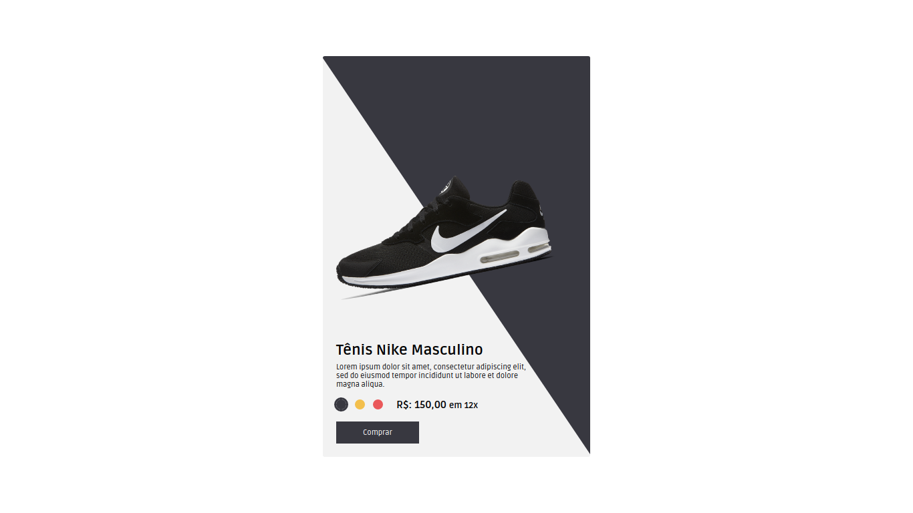
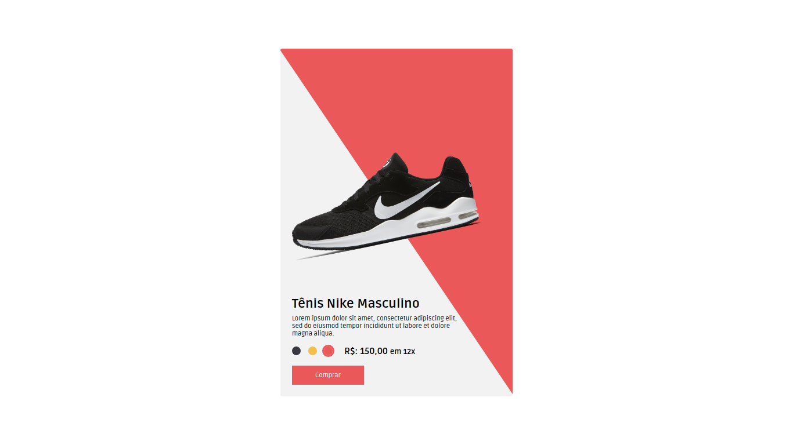
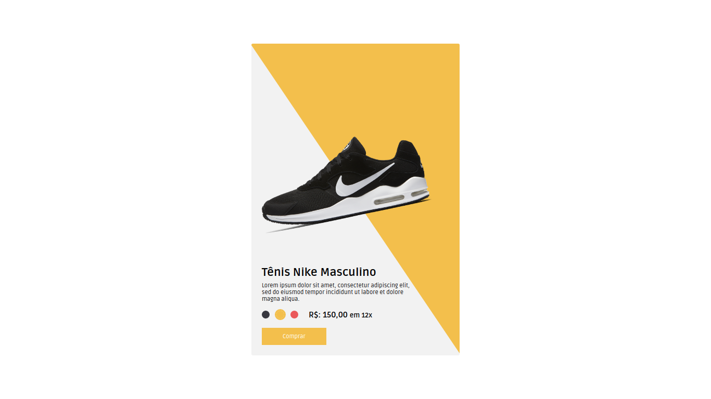

Olá, tudo bem?

Fico agradecido e feliz por você está por aqui vendo um dos meus projetos.

# Sobre o projeto

Esse é um pequeno projeto para praticar e aperfeiçoar minhas skills como desenvolvedor Front End.

A ideia inicial surgiu, quando vi uma propaganda na TV com algo bem parecido, e daí veio a ideia de fazer um banner totalmente construído com HTML, CSS e JS.

Neste projeto eu estou utilizando apenas: HTML, CSS e JS.

Eu também prático um pouco de animação usando CSS.

Segue abaixo alguns screenshots:

# Vídeo de demonstração do projeto:

<figure class="video_container">
  <video controls="true" allowfullscreen="true">
    <source src="./screenshot/video-demonstracao.mp4" type="video/mp4">
    <source src="./screenshot/video-demonstracao.ogg" type="video/ogg">
    <source src="./screenshot/video-demonstracao.webm" type="video/webm">
  </video>
</figure>

## Contato

E-mail: carlos.contato00@gmail.com

Website: [https://carloseduardo.dev](https://carloseduardo.dev)

Atenciosamente,

Cadu.